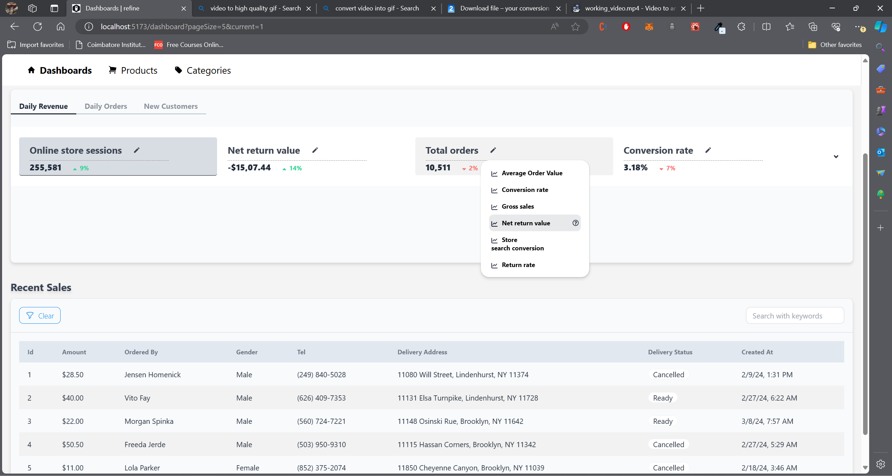

# Project: admin-panel

## How to run ?

```bash
# Clone the project to local
git clone https://github.com/YashNarK/admin-panel.git
# Open project folder
cd admin-panel
# Install dependencies
npm i
# Run the app in dev mode
npm run dev
```

## How it looks in browser ?


### Loading Screen


### Initial Screen


### Hovering the stats


### Hovering the stat heading


### Dropdown selector


### Hover dropdown content



### Expanded chart and custom legend - accordion


### Hovering the chart - custom tooltip


## Components

            click component's name to open any component's tsx file

1. [CustomizedLegend](./src/components/CustomizedLegend/CustomizedLegend.tsx)
   - The legend placed under the line chart takes the date range of current year's revenue data and past year's revenue data as inputs and displays the same. It has a small icon of the line type which helps user to identify which date range corresponds to which line.
2. [CustomTooltip](./src/components/CustomTooltip/CustomTooltip.tsx)
   - The custom tooltip shows the value of both the new revenue line and old revenue line, along with its difference. It also has a small icon of the line type which helps user to identify which value corresponds to which line.
3. [DropdownButton](./src/components/DropdownButton/DropdownButton.tsx)
   - Dropdown icon to select the comparison stat type, which can then be used for comparison. While hovering over the dropdown contents, user gets a circled question mark icon at the end of each option for more info.
4. [Skeleton](./src/components/Skeleton/Skeleton.tsx)
   - The skeleton is just a placeholder UI which fills the chart and stat area of UI while the data is being fetched from the backend server.
5. [StatFlex](./src/components/StatFlex/StatFlex.tsx)
   - The stat flex component is a flex box of multiple stat item, each comes with its own custom info box for displaying more information about the stat when user hovers over the stat title/heading. It also has our above mentioned dropdown component alongside stat title/heading.
6. [dashboard/ResponsiveLineChart](./src/components/dashboard/ResponsiveLineChart.tsx)
   - Responsive Line Chart component is the core visualization component that fetches the data, memoize it and then displays in the form of rechart's line chart. It utilizes all our aforementioned components to achieve its look and functionality. It also has an collapse/accordion that displays only stat flex on collapse and then can expand into chart on click.

## Interface/Types

[Click to open - Interface File](./src/interfaces/index.ts)

1. `TLineData` - The data type required for the line data in ResponsiveLineChart component
2. `IStatItem` - The interface required for the data to fill each stat item in StatFlex component
3. `IOldData` - The interface requried for parsed response data for past year's revenue. This uses a custom json server to provide the necessary data.
4. `TResponseData<T>` - The data type to parse the actual response we get for past year's revenue data.

## Data

A new backend server is setup that focuses on serving 2023's revenue data (randomly generated using GPT) in form of a JSON object.

- API Endpoint: https://my-json-server.typicode.com/YashNarK/demo-admin-db/data
- Source File: https://github.com/YashNarK/demo-admin-db/blob/main/db.json

- Hosting service: https://my-json-server.typicode.com
- Limitation: Only 30 data value per account in free category.

- Due to the limitation of 30 data points per account, we only have data for the date range `28 Feb, 2023` to `29 Mar, 2023`.
- One can use `_gte` and `_lte` query parameters used for filtering data based on date ranges in the provided URL.
- By using these parameters, our dashboard automatically gets the revenue data for last year starting from `8 days before today's date last year` to `yesterday's date last year` with repsect to `IST`

- Example:

```bash
curl "https://my-json-server.typicode.com/YashNarK/demo-admin-db/data?date_gte=2023-02-29&date_lte=2023-03-07"

```

## Helper functions

[Click to open utility.ts](./src/helpers/utility.ts)

1. formatDate
   - `function formatDate({ inputDate, format }: TDateFormat): string`
   - Takes dates in any accepted date format, in string data type and converts them to one of the three formats: `"MMM DD, YYYY" | "YYYY-MM-DD" | "DD, MMM"`
   - This function is used extensively in the ResponsiveLineChart and its children components to format date in data, legend, tooltip etc.,

## Services

            click service's name to open any service's .ts file

1. [api-client.ts](./src/services/api-client.ts)
   - The axios client is initialized and base url is set.
2. [http-service.ts](./src/services/http-service.ts)
   - Generic http service that is data type agnostic and can work with any response type. Only GET with params is defined as our app needed only this method.
3. [revenue-data-service.ts](./src/services/revenue-data-service.ts)
   - The old revenue data is hosted as `{BASE_URL}/data` endpoint. Hence, we initialize the generic http-service object with the `"/data"` endpoint.

## Custom hooks

            click hook's name to open any hook's .ts file

1. [useData](./src/hooks/useData.ts)
   - A generic hook that queries the any data using tanstack query's useQuery hook and our generic `http-service`. It manages cache for the fetched data. The query params are set as queryKey and the same would serve as dependencies for side effects.
2. [useOldRevenueData](./src/hooks/useOldRevenueData.ts)
   - A old revenue data based on the `revenue-data-service` object and any params we provide. It uses generic useData hook to complete the data fetch. This hook is used in ResponsiveLineChart component to get data for old revenue line.

## CSS frameworks and Icons collection used

1. [Daisy UI](https://daisyui.com/)
2. [Tailwind CSS](https://tailwindcss.com/)
3. [React Icons](https://react-icons.github.io/react-icons/)

## Charts Library used

1. [Recharts](https://recharts.org/)
